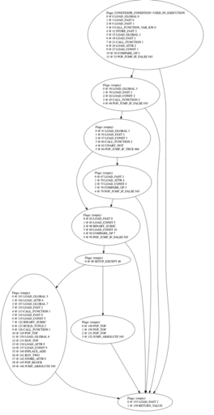
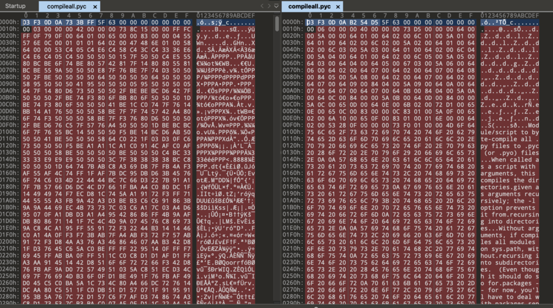

# unfuck

Have fucked Python 2.7 bytecode? Let's `unfuck` it.

## Overview

unfuck is a utility and library for deobfuscating obfuscated Python 2.7 bytecode. It is essentially a reimplementation of the Python VM with taint tracking. Some of the things unfuck can do:

1. Remove opaque predicates
2. Dead code elimination
3. Restore some lost function names
4. Cleanup obfuscated variable names

#1 and #2 are the two biggest items that Python decompilers trip over when attempting to reconstruct original Python source code.

unfuck basically makes your bytecode go from this to this:




Or from this to this:

[](./img/obfuscated_bytecode.png)

Yes, these are real-world examples.

### Useful Wiki Resources

- [Obfuscation Tricks](https://github.com/landaire/unfuck/wiki/Obfuscation-Tricks)
- [Deobfuscation Passes](https://github.com/landaire/unfuck/wiki/Deobfuscation-Passes)
- [Debugging Failed Decompilation](https://github.com/landaire/unfuck/wiki/Debugging-Failed-Decompilation)

## Usage

unfuck can either be used as a library or a command-line utility.

```
unfuck 0.2.0

USAGE:
    unfuck [FLAGS] [OPTIONS] <input-obfuscated-file> <output-path> [graphs-dir] [SUBCOMMAND]

FLAGS:
        --dry        Dry run only -- do not write any files
    -g               Enable outputting code graphs to dot format
    -h, --help       Prints help information
    -q               Disable all logging
    -V, --version    Prints version information
    -v               Enable verbose logging

OPTIONS:
        --decompiler <decompiler>    Your favorite Python 2.7 bytecode decompiler. This program assumes the decompiler's
                                     first positional argument is the file to decompile, and it prints the decompiled
                                     output to stdout [env: UNFUCK_DECOMPILER=]  [default: uncompyle6]

ARGS:
    <input-obfuscated-file>    Input obfuscated file
    <output-path>              Output file name or directory name. If this path is a directory, a file will be
                               created with the same name as the input. When the `strings-only` subcommand is
                               applied, this will be where the output strings file is placed
    <graphs-dir>               An optional directory for graphs to be written to [default: .]

SUBCOMMANDS:
    help            Prints this message or the help of the given subcommand(s)
    strings-only
```

To unfuck a single file:

```
# deobfuscated.pyc can also be a directory
unfuck obfuscated.pyc deobfuscated.pyc
```

You can also provide additional flags to dump strings to a file, or dump `dot` graphs that can be viewed in graphviz:

```
# -g is for printing graphs
unfuck -g obfuscated.pyc deobfuscated.pyc
# use the strings-only subcommand for dumping just dumping strings -- no deobfuscation is performed
unfuck deobfuscated.pyc ./strings.csv strings-only
```

### Building

unfuck requires Python 2.7 in your system's `PATH`. After ensuring it's present, you should be able to just `cargo build`. If for some reason the correct interpreter cannot be found, try setting the `PYTHON_SYS_EXECUTABLE` env var to your Python 2.7 interpreter path.

### Installing

`cargo install --force unfuck`

### Library Usage

**NOTE:** unfuck was not originally designed with library usage in mind, and therefore brings its own multithreading platform (in this case, Rayon).

Usage is fairly straightforward:

```rust
use std::convert::TryInto;
use std::fs::File;

let mut pyc_contents = vec![];
let pyc_file = File::open("obfuscated.pyc")?;
pyc_file.read_to_end(&mut pyc_contents)?;

// magic/moddate are specific to the PYC header and are required to be
// a valid PYC file
let magic = u32::from_le_bytes(pyc_contents[0..4].try_into().unwrap());
let moddate = u32::from_le_bytes(pyc_contents[4..8].try_into().unwrap());

let pyc_contents = &pyc_contents[8..];

// Use a standard Python 2.7 opcode table
let deobfuscator = unfuck::Deobfuscator::<pydis::opcode::py27::Standard>::new(pyc_contents);
let deobfuscator = if enable_graphs {
    deobfuscator.enable_graphs()
} else {
    deobfuscator
};

let deobfuscated_code = deobfuscator.deobfuscate()?;

let mut deobfuscated_file = File::create("deobfuscated.pyc")?;
deobfuscated_file.write_all(&magic.to_le_bytes()[..])?;
deobfuscated_file.write_all(&moddate.to_le_bytes()[..])?;
deobfuscated_file.write_all(deobfuscated_code.data.as_slice())?;
```

## greetz

gabe_k, yrp, lpcvoid, folks from the WD disc, squif, ian, pie doom, saruhan